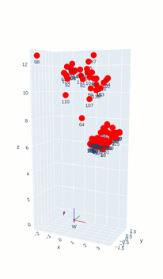
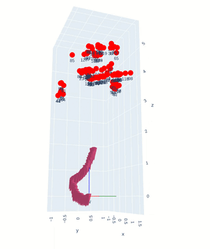

# Robust estimation of multiview geometry
This repository is a collection of experiments and tests I did in order to fully understand multiview geometry. This code is written in Python and uses OpenCV for some of the functions.

Every test was done using SIFT features and RANSAC using BFMatcher, even though an ORB folder exists for comparision purposes.
## [Homography estimation between two images](src/sift/homography.py)
Given two images, the homography matrix is estimated using RANSAC. The homography matrix is then used to show the first image plane to the second image. The result is shown below (the second image being a video):

## [Epipole geometry calculation](src/sift/epipoles.py)
In a similar way as the homography estimation, the epipoles are estimated using RANSAC. The epipoles are then used to show the first image plane to the second image:

## [3D Representation](src/sift/Camara3d_two_views.py)
Now that we know how to obtain the homography between two images, we can easily obtain the 3D representation of the scene. The following video shows the 3D representation of the scene:

## [Camera representation](src/sift/Camera_3d_traslation.py)
Now we have a 3D representation of the environment using only two images, we can get the position of any third camera in the scene given an image, and therefore we could recreate the traslation of a camera in a video across the scene:

## [Frame warping](src/sift/warp_perspective.py)
Finally, using homography we can do cool things as linking a frame to a video on its original plane:
